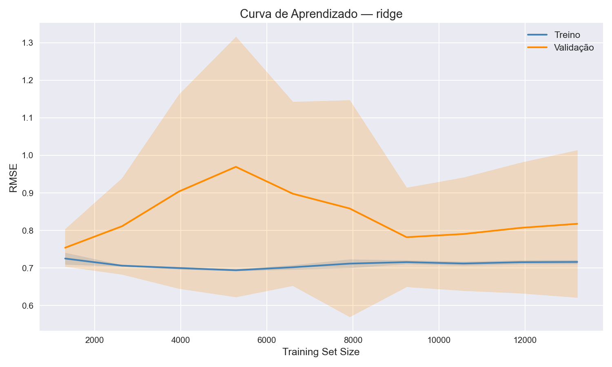

# credit-risk-sklearn-pipeline

## Problem

Regressão para prever o valor mediano de imóveis (proxy de risco de crédito) usando o California Housing dataset. Objetivo: demonstrar um pipeline ML produtizável com Scikit-Learn — desde o download dos dados até comparação de modelos e curvas de aprendizado.

## Dataset

- **Fonte:** `sklearn.datasets.fetch_california_housing` (StatLib, 1990 Census)
- **Dimensões:** 20.640 amostras × 8 features numéricas + 1 target
- **Features principais:** `MedInc` (renda mediana), `HouseAge`, `AveRooms`, `AveBedrms`, `Population`, `AveOccup`, `Latitude`, `Longitude`
- **Target:** `MedHouseVal` — valor mediano dos imóveis em centenas de milhares de dólares

## Technical Decisions

- **Estratificação:** `train_test_split` estratificado por faixas de `MedHouseVal` (`pd.cut` em 5 bins) para garantir distribuição uniforme do target em treino e teste, evitando que imóveis caros ou baratos se concentrem em um único conjunto.

- **Feature engineering:** `RatioFeatureTransformer` cria 3 features de razão — `rooms_per_household`, `population_per_household` e `bedrooms_per_room`. Valores absolutos como `AveRooms` são ruidosos sem contexto: um bloco com 10 quartos e 2 domicílios indica algo muito diferente de 10 quartos e 10 domicílios. A razão captura densidade habitacional real, que correlaciona melhor com o valor do imóvel.

- **Modelo escolhido:** `Ridge` (alpha=1.0) — melhor RMSE no test set (0.7215) e R² de 0.61. Apesar do ElasticNet apresentar RMSE médio ligeiramente menor no CV (0.8019 vs 0.8177), o alto desvio padrão do Ridge no CV (0.1958) indicava instabilidade nos folds com poucos dados — no test set final o Ridge supera todos os modelos, sugerindo que a regularização L1 do Lasso/ElasticNet penaliza demais as features contínuas desse dataset.

## Results

| Model      | CV RMSE | CV Std | Test RMSE |
|------------|---------|--------|-----------|
| **Ridge**  | 0.8177  | 0.1958 | **0.7215**|
| Linear     | 0.8253  | 0.2110 | 0.7216    |
| ElasticNet | 0.8019  | 0.0123 | 0.7970    |
| Lasso      | 0.8198  | 0.0059 | 0.8227    |

RMSE em unidades de $100k — o Ridge erra em média ~$72k por previsão no test set.

## Learning Curve



O Ridge apresenta **underfitting leve**: a curva de treino estabiliza em ~0.70 desde o início, enquanto a validação converge para o mesmo patamar apenas após ~9.000 amostras — indicando que o modelo tem viés, não variância. O gap pequeno entre as curvas descarta overfitting. O R² de 0.61 confirma que relações não-lineares entre localização e valor dos imóveis não estão sendo capturadas por um modelo linear.

## What I'd Do Differently

1. Testar modelos não-lineares (Random Forest, Gradient Boosting) para capturar interações entre `Latitude`/`Longitude` e `MedInc` que o modelo linear ignora.
2. Adicionar features geográficas derivadas (distância ao oceano, ao centro urbano) em vez de usar coordenadas brutas, que criam uma superfície de decisão não-linear difícil para regressão linear.
3. Usar `HalvingRandomSearchCV` no fine-tuning para explorar mais combinações de hiperparâmetros com o mesmo orçamento computacional.

## How to Run

```bash
# Instalar dependências
pip install -r requirements.txt

# Baixar e cachear o dataset
python data/download.py

# Comparar todos os modelos (CV)
python -m src.train --model all --cv 5

# Avaliar no test set + gerar curvas de aprendizado
python -m src.evaluate

# Fine-tuning do melhor modelo
python -m src.train --fine-tune --cv 5

# Rodar testes
pytest tests/ -v
```
